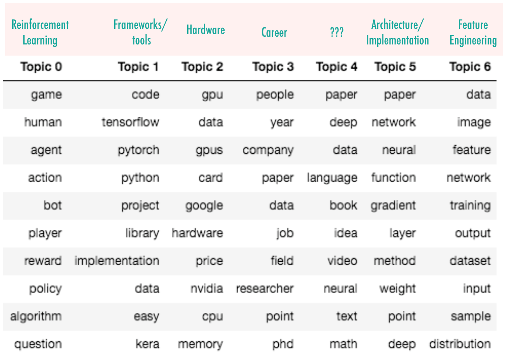

# Reddit-Models

Will contain my various analyses of reddit activity. 

# Topic Modeling
A great way to get a sense of a community's interest is to do topic modeling on their activity.
To explore this, I used an Latent Dirichlet Allocation (LDA) algorithm on submissions from the Machine learning subreddit (basically so I could say I'm machine learning the machine learning subreddit). 
I used a couple reddit APIs ( [pushshift](https://github.com/dmarx/psaw) and [PRAW](https://praw.readthedocs.io/en/latest/)) to gather all text associated with a document, for all documents in a two year window from 2017-now. 

To get a sense of the result, I printed out the words most assigned to each topic:

At the top, I put my guesses for what each topic may be representing.

[Explore my topic model interactively using the visualization at the bottom of this notebook](https://nbviewer.jupyter.org/github/vsoni1/DI_submit/blob/master/Reddit%20Topic%20Modeling%20notebook.ipynb)

# Reddit Titles
Reddit Titles is an old notebook exploring classifying the success of titles for a reddit submission.
I tried it out on the 'kanye' subreddit for now since it is quite active, it's about a controversial figure, and the community has a unique lexicon they've adopted. 
